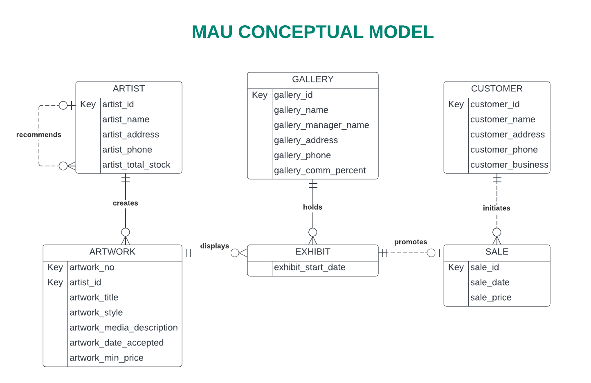
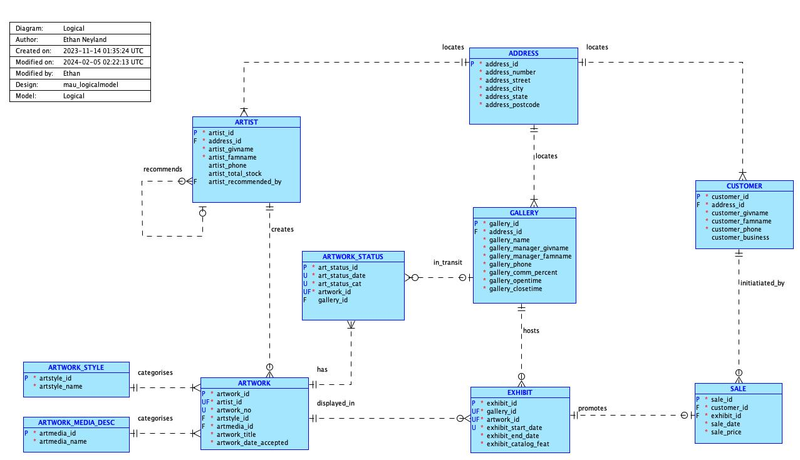
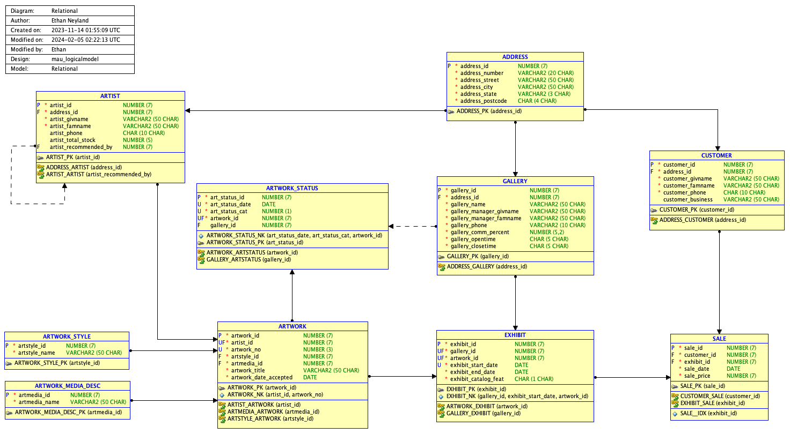

# MAU ERD Modelling
Melbourne Art Union (MAU) conceptual, logical and relational modelling for a SQL Relational Database Management System (RDBMS).
SQL Relational Database Project (group, revised and updated as individual).
Project completed using Lucid and Oracle SQL Developer.

Contents:
- MAU project brief
- [Conceptual, Logical and Relational Models](#mau-conceptual-logical-and-relational-models-all)

## MAU project brief / business rules
Melbourne Art Union (MAU) is a company that accepts artworks from artists and offers these artworks to galleries around the country for display and potential sale. The galleries display the artworks supplied by MAU as part of their exhibitions. A registered MAU customer may, while the artwork is being displayed, decide to purchase the item. MAU charges a standard percentage of the price at which the artwork is sold as their commission (note that this does not need to be recorded as part of the model). The gallery is paid a standard percentage of the sale price as its commission, this percentage is negotiated per gallery and so may vary from gallery to gallery (this gallery percentage must be recorded as part of the model). The remainder of the sale price goes to the artist.

An artist will approach MAU to represent them. If MAU accepts the artist, they will be added to the MAU system before any artworks are accepted. MAU assigns an artist code to each artist that the company represents. MAU records the artist's name, contact address and telephone number (not all artists supply a telephone number). When an artist has completed an artwork that they wish to sell through MAU, they contact the company and offer the work to be sold by MAU. MAU maintains for each artist the number of works that MAU currently holds in stock for that artist. Sometimes, an artist recommends MAU as an agent to other artists who do not currently exhibit/sell through MAU. MAU wishes to record the fact that an artist may recommend other artists to join MAU.

All artworks accepted by MAU are assigned an artwork number specific to a particular artist. For example, artist 1234 will have artworks 1, 2, 3 etc. and artist 4567 will also have artworks 1, 2, 3 etc.  The title of the artwork, the date the work was accepted into the MAU system and the minimum price at which the artist is prepared to sell their work are recorded. The work may be sold for any price above this minimum so that the artist receives at least this amount and the gallery and MAU also receive their commissions.

Each artwork accepted by MAU is assigned:
- a style—typical values are listed at Artworks by style (WikiArt n.d.)
- a media description—typical values are listed at Artworks by media (WikiArt n.d.) 

Only one style and media description are applied to each artwork.

A gallery is identified by a gallery ID. MAU records the name of the gallery, the gallery manager’s name, the address of the gallery and the contact phone number for the gallery (all galleries are required to provide a contact number). 

Art collectors who are interested in purchasing artwork must register with MAU as a customer before they are able to make any purchase. Some customers will register but may not yet have purchased any artwork. Each customer is identified by their customer ID. The customer's name, address and contact phone number are recorded. If the customer is a business customer their business name is also recorded.

A gallery considers the artworks that MAU has on offer and then requests and exhibits (displays) the artwork in its gallery with the intention of generating a sale. The date on which the exhibit starts is recorded. If the item generates little interest then the gallery will return the artwork to MAU. At a later date, after it is back at MAU, the gallery might request and display the same artwork again.

When an artwork from MAU stock is sold, the sale is assigned a unique sale ID. The artwork, date of the sale, sale price and customer who purchased the item is recorded. MAU is interested in identifying which exhibit generates a particular sale.

--- --- --- --- --- --- --- --- --- --- --- --- --- --- --- --- --- --- --- --- --- --- --- --- --- --- --- --- --- ---

## MAU Conceptual, Logical and Relational Models (ALL)

### MAU Conceptual Model

### MAU Logical Model

### MAU Relational/Physical Model

